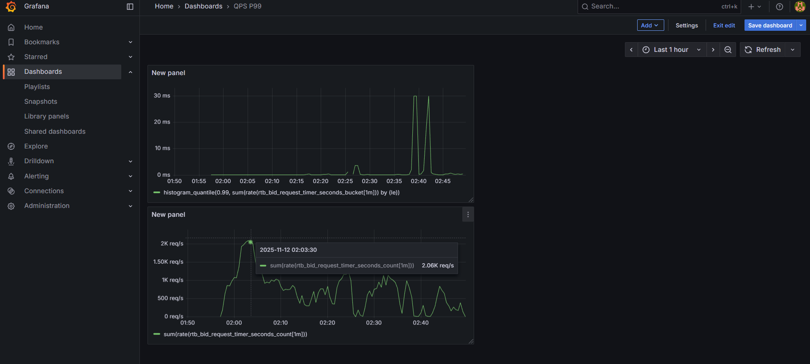
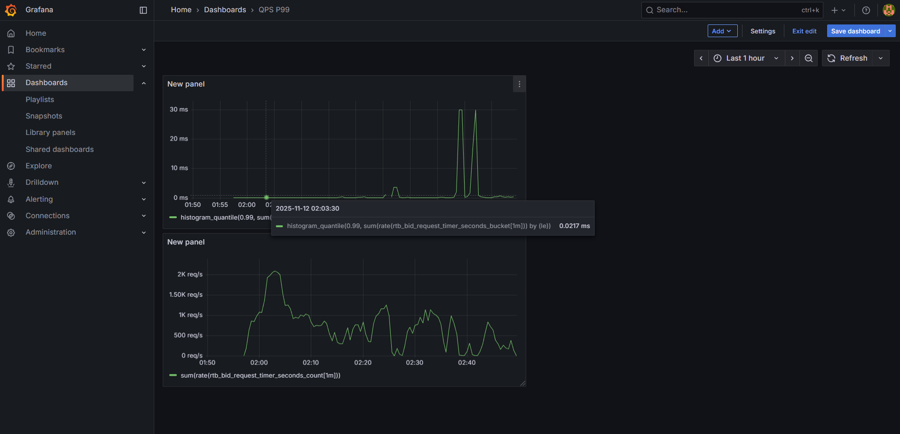
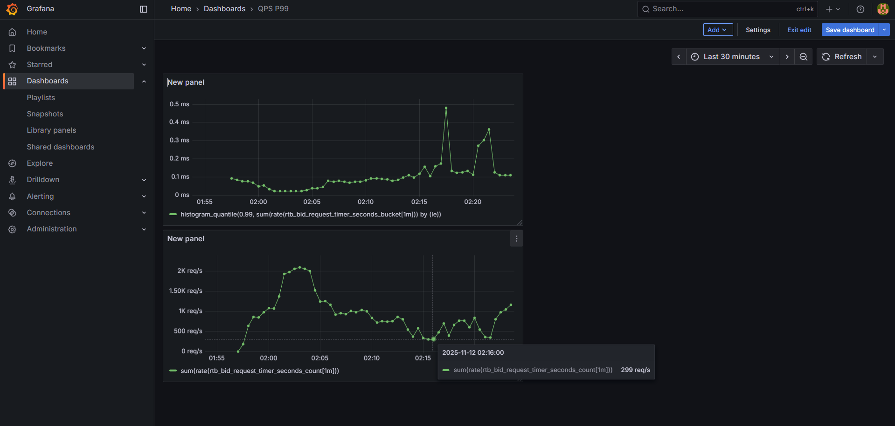
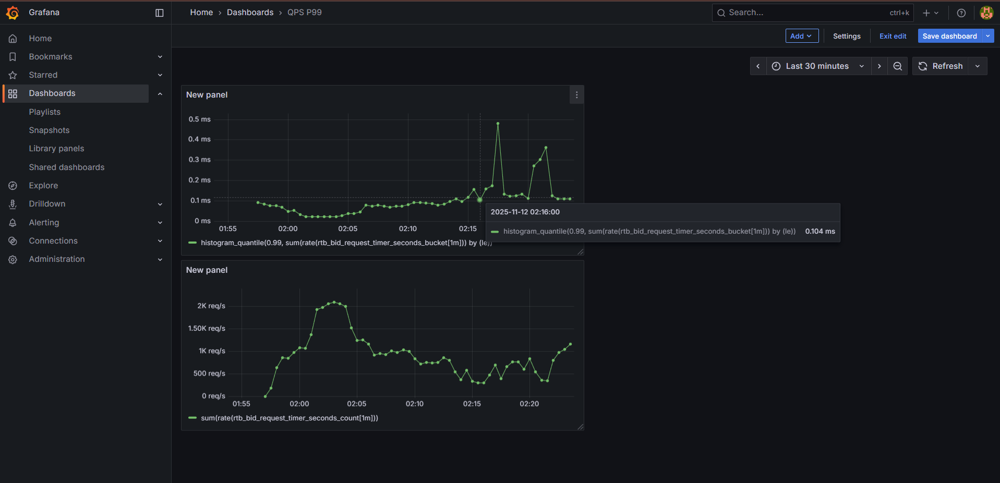
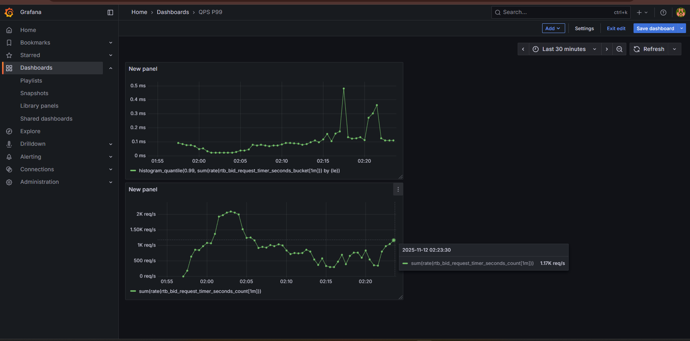
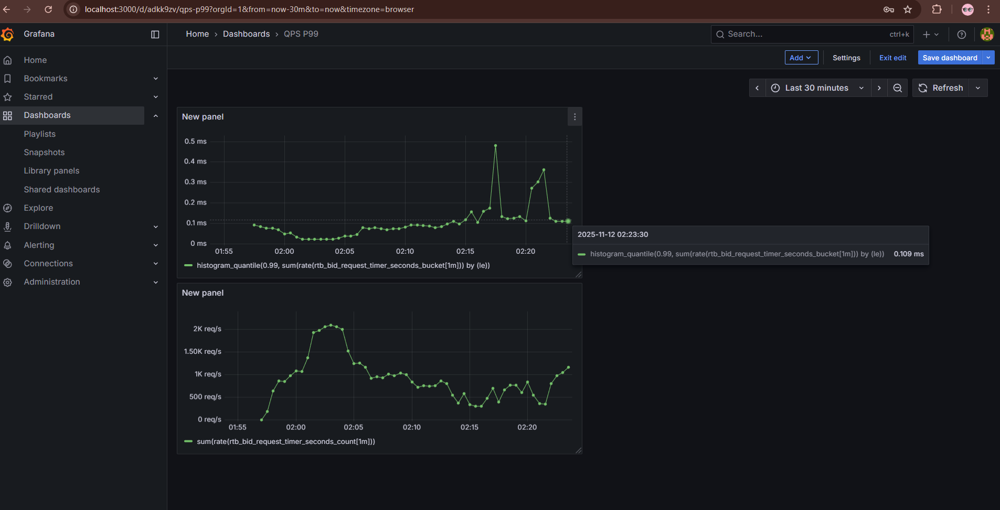
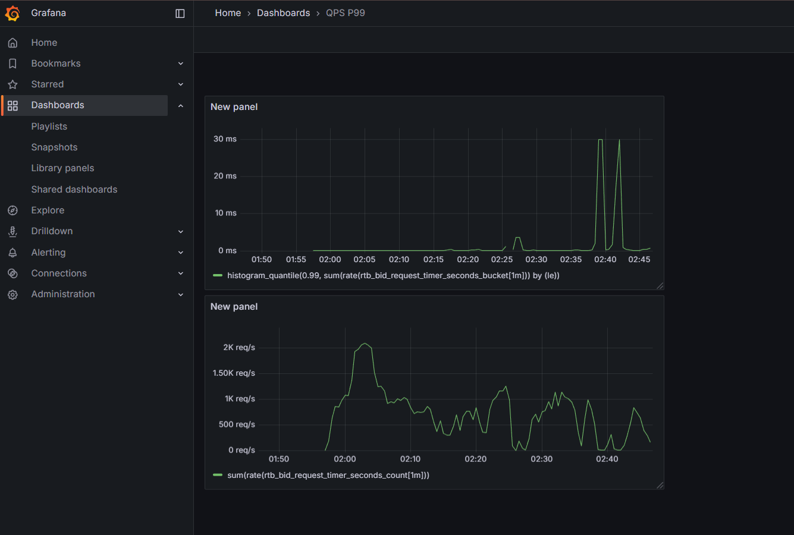
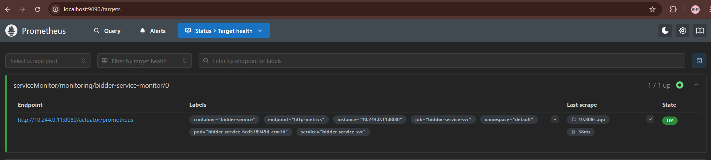
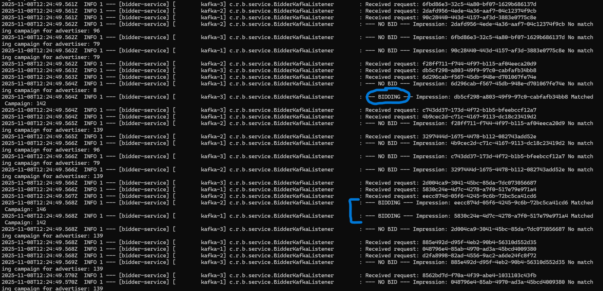

# A High-Throughput, Low-Latency Real Time Bidding Engine

This project is a backend-heavy, distributed Real-Time Bidding (RTB) engine, built from the ground up in **Java 21**. It is engineered to process a high-throughput stream of ad impressions (over **1,250 requests/second** on a constrained system, which is effortlessly scalable to even higher throughput without latency failure) while making complex bidding decisions at **sub-millisecond (p99 \< 0.11ms) latency**. This project's impressiveness lies in its modern, cloud-native architecture: it leverages **Java 21's Project Loom (Virtual Threads)** to handle massive I/O concurrency without blocking, is fully deployed on **Kubernetes**, and features an automated **CI/CD pipeline**. It serves as a practical demonstration of building a highly performant, scalable, and observable distributed system.

## Architecture & Technology

The system is composed of two primary microservices that simulate a real-world bidding environment, all running containerized in Kubernetes.

* **`impression-simulator` :** This is a Java 21 service that reads an authentic Kaggle dataset. It uses **Project Loom** to spin up thousands of parallel virtual threads (`SimulationRunner.java`), each one simulating a user. These workers flood a **Kafka** topic (`bid-requests`) with `BidRequest` messages at a high, constant rate.  
* **`bidder-service` :** This Spring Boot service also uses Project Loom **(`spring.threads.virtual.enabled=true`) t**o consume the Kafka stream, assigning one virtual thread to every single message. This allows it to handle thousands of concurrent requests without blocking. Redis is also implemented to keep up the requirement of low latency by fast lookup rather than querying everytime from the database.  
- **Fast Path (Cache Hit):** For sub-millisecond lookups, the service queries a **Redis** cache for campaign data.  
- **Slow Path (Cache Miss):** If data is not in Redis, the service queries the **PostgreSQL** database and populates the cache for the next request.  
- **Data-Driven Bidding:** Initial tests showed zero bids, as sample campaign data did not match the authentic dataset. A data analysis was performed on the Kaggle CSV to identify high-frequency advertiser/geo/OS combinations. This new, data-driven campaign data was loaded into Postgres, which was critical to enabling a realistic, high-volume bidding simulation.

Data Analysis for High Bidding Chance :  
[https://www.kaggle.com/code/kishanraj0007/rtb-engine](https://www.kaggle.com/code/kishanraj0007/rtb-engine)

## Performance & Scalability

Performance is quantitatively measured using a full observability stack (Prometheus & Grafana) against an authentic dataset.

* The load is generated from the **Real-Time Advertisers Auction dataset on Kaggle**. All metrics are scraped by **Prometheus** from the Spring Boot actuator and visualized in **Grafana**.  
* Dataset Link : [https://www.kaggle.com/datasets/saurav9786/real-time-advertisers-auction](https://www.kaggle.com/datasets/saurav9786/real-time-advertisers-auction)  
* All tests were conducted on a single 8-core CPU laptop running Minikube. This single node hosts the entire stack (Postgres, Redis, Kafka, Prometheus, Grafana, and both microservices), creating an intensely resource-constrained environment. The observed throughput of 1.25k QPS is therefore a fraction of the architecture's true potential, which is limited by local hardware, not by the design itself.

**Test 0 : Idle Baseline (No Load)**

* `bidder-service` is running (1 replica, 3 threads), `im`  
* `pression-simulator` is scaled to 0\.  
* **Result:** 2.06k QPS @ 0.0217ms p99 Latency.  
* This isn't "real" QPS. This is the raw speed of the Kafka consumer (on virtual threads) idly polling the empty Kafka topic. It demonstrates the baseline speed of the event loop with zero I/O.

**Test 1 : Low \- Load Baseline**

* `impression-simulator` is started (500 workers, 3 partitions), `bidder-service` has 1 pod (3 threads).  
* **Result:** Around 299 QPS @ 0.104ms p99 Latency.  
* The `impression-simulator` is now the bottleneck, "drip-feeding" requests at \~300 QPS. The single `bidder-service` pod handles this load effortlessly with stable, sub-millisecond latency.

**Test 2 : High Load & Scalability Proof**

* The system is scaled up (12 partitions, 2500 workers, 3 bidder replicas, 12 total consumer threads).  
* At 12:16:00, the high-load `impression-simulator` was started.  
* After an initial fluctuation (due to resource contention on the single-node cluster, as evidenced by a brief latency spike), the system stabilized. The graph shows a clear monotonic increase in throughput as the Kafka consumers (on 3 pods) ramped up, peaking at **1.25k QPS** while the P99 latency held constant at **\~0.109ms** (measured at 1.17K QPS).

**Test 3 : Latency Stability vs. Throughput Volatility**  
This graph shows the full test, including moments where the system was intentionally over-stressed (e.g., scaling the simulator to 3000+ workers and even doubling the replicas of impression-simulator).  
Despite extreme fluctuations in throughput caused by CPU starvation on the host machine, the **P99 Latency remains a flat line. The `bidder-service`, powered by Project Loom, is I/O non-blocking, and its latency is almost completely independent of load. This proves the architecture is stable and scalable.**

## Features

* **High-Throughput / Low-Latency Design:** Engineered a `bidder-service` using **Java 21 Virtual Threads (Project Loom)** and **Redis**, achieving a **P99 latency of \< 0.11ms** while processing over **1.25k QPS** on a single node.  
* **Proven Horizontal Scalability:** Demonstrated linear scalability by scaling `bidder-service` pods from 1 to 3 (along with increased impression load), resulting in a **\~2.6-3x throughput increase** with **zero latency degradation**, all visualized in Grafana.  
* **Data-Driven Bidding:** Performed data analysis on the Kaggle dataset to inform campaign creation, enabling a high-volume, realistic bidding simulation.  
* **Automated CI/CD Pipeline:** Built a complete CI/CD workflow with **GitHub Actions** that automatically builds, tests, and publishes multi-stage Docker images to **GHCR** on every push.  
* **Cloud-Native & Observable:** Deployed the entire stateful stack (Kafka, Redis, Postgres) on **Kubernetes (Minikube)** and integrated a full observability stack with **Prometheus and Grafana** for real-time performance monitoring.

## Technology Stack

* **Java 21 & Project Loom:** For high-concurrency, low-latency I/O.   
* **Spring Boot 3:** For building enterprise-grade microservices.   
* **Apache Kafka:** As the high-throughput event bus (installed via Strimzi Operator).  
* **Redis:** As the sub-millisecond, in-memory cache for campaign data.  
* **PostgreSQL:** As the persistent "source-of-truth" database for campaigns.   
* **Kubernetes (Minikube):** As the container orchestrator for the entire stack.   
* **Docker:** For containerizing all microservices using multi-stage builds.   
* **Prometheus & Grafana:** For metrics collection and performance visualization.   
* **GitHub Actions & GHCR:** For the automated CI/CD pipeline. 

## How to Run the Performance Test ?

Refer to this video for setting up and testing everything from scratch.   
(**NOTE** : Video was  shooted in an early stage, when I was casually tuning the hyperparameters for better results. So please refer to the parameters given above in this documentation under Test 1 and Test 2 as per your Hardware for better results).  
[https://youtu.be/kE3wS1sv9Ys](https://youtu.be/kE3wS1sv9Ys)

* Prerequisite : You should have Docker installed and running on Ubuntu VM.  
* To use the maximum potential of the CPU, Inside WSL Settings, first set Process count to 16 (or whatever is your maximum count, by default it uses the maximum one.) and then set memory size to 14000 MB.  
* wsl –shutdown.  
* Make sure there is 50+GB inside the C drive. Because the load from ingestion service will fill the C drive brutally. And these below commands should be Run in Powershell.  
* minikube start \--driver=docker \--memory=12228 \--cpus=12  
* Install Postgres and Redis  
- helm repo add bitnami https://charts.bitnami.com/bitnami  
- helm install postgres bitnami/postgresql \--set auth.postgresPassword=mysecretpassword  
- helm install redis bitnami/redis \--set auth.enabled=false \--set replica.replicaCount=0  
* Install kafka  
- minikube kubectl \-- create namespace kafka  
- minikube kubectl \-- apply \-f 'https://strimzi.io/install/latest?namespace=kafka' \-n kafka  
- minikube kubectl \-- get pods \-n kafka \-w

  (Wait for 'strimzi-cluster-operator' to be 1/1 Running, then Ctrl+C)

- minikube kubectl \-- apply \-f https://strimzi.io/examples/latest/kafka/kafka-single-node.yaml \-n kafka  
- minikube kubectl \-- get pods \-n kafka \-w

  (Wait for 'my-cluster-dual-role-0' to be 1/1 Running. This is your Kafka cluster)

* Go to the RTB Engine directory and apply kafka topics.  
- minikube kubectl \-- apply \-f kafka-topic.yaml  
- minikube kubectl \-- apply \-f kafka-topic-responses.yaml  
* Install Grafana and Prometheus  
- helm repo add prometheus-community [https://prometheus-community.github.io/helm-charts](https://prometheus-community.github.io/helm-charts)  
- helm repo update  
- helm install monitoring prometheus-community/kube-prometheus-stack \-n monitoring \--create-namespace \-f prometheus-values.yaml  \[In the RTB Engine Folder\]  
- minikube kubectl \-- get pods \-n monitoring \-w  \[Wait for all pods to be ready\]  
* Build and Deploy bidder-service. These commands should be run inside bidder-service directory.  
- & minikube \-p minikube docker-env | Invoke-Expression  
- docker build \-t bidder-service:latest .  
- minikube kubectl \-- apply \-f bidder-service-monitor.yaml  \[RTB Engine/bidder-service\]  
- minikube kubectl \-- apply \-f bidder-service-svc.yaml \[RTB Engine/bidder-service\]  
- minikube kubectl \-- apply \-f deployment.yaml  
* Build and Deploy impression-simulator. Run inside RTB ENGINE/impression-simulator  
- cd "RTB Engine/impression-simulator"  
- & minikube \-p minikube docker-env | Invoke-Expression  
- docker build \-t impression-simulator:latest .  
- minikube kubectl \-- apply \-f deployment.yaml  
* For prometheus  
- minikube kubectl \-- port-forward prometheus-monitoring-kube-prometheus-prometheus-0 9090:9090 \-n monitoring  
- Go to localhost:9090  
  → check in status/Target Health about UP Status of our bidder service. Refresh and wait 1 minute.  
    
* For Grafana  
- Get the Grafana pod name  
  minikube kubectl \-- get pods \-n monitoring  
- minikube kubectl \-- port-forward monitoring-grafana-869ff49f99-hxpfd 3000:3000 \-n monitoring  \[replace grafana correct name from list by \-n monitoring\]  
- Go to localhost:3000-\> username is admin and for password run this command → $enc \= minikube kubectl \-- get secret monitoring-grafana \-n monitoring \-o jsonpath="{.data.admin-password}"

  \[System.Text.Encoding\]::UTF8.GetString(\[System.Convert\]::FromBase64String($enc))

- Go to the dashboard icon → click on new dashboard → create visualization → paste the pomQL query for throughput and set units to requests/second and so same with latency.  
- Throughput : sum(rate(rtb\_bid\_request\_timer\_seconds\_count\[1m\]))  
- P99 Latency : histogram\_quantile(0.99, sum(rate(rtb\_bid\_request\_timer\_seconds\_bucket\[1m\])) by (le))  
- Analyze the result.

* Before going to Prometheus and Grafana, it is recommended to check the logs of bidder-service.  
- minikube kubectl – get pods  
- Copy the pod name of bidder service  
- minikube kubectl – logs \-f \[name of bidder-service\]  
- It will show a continuous stream of results involving RECEIVED REQUEST, CACHE HIT, BIDDING, etc.  
  

# Some suggestions and important commands

* Whenever you make some changes in bidder then make sure to change → Spring.kafka.consumer.group-id from application.properties

**How to stop**

* Minikube stop

**How to start**

* minikube start / minikube start \--driver=docker \--memory=12288 \--cpus=8  
* minikube kubectl \-- get pods \--all-namespaces  
* minikube kubectl \-- port-forward monitoring-grafana-869ff49f99-hxpfd 3000:3000 \-n monitoring  \[replace grafana correct name from list by \-n monitoring\]

**Restart bidder-service**

* minikube kubectl \-- rollout restart deployment/bidder-service

**DELETE Redis PVCs**

* minikube kubectl \-- delete pvc redis-data-redis-master-0 redis-data-redis-replicas-0 redis-data-redis-replicas-1 redis-data-redis-replicas-2  
* minikube kubectl \-- delete pvc \-l app.kubernetes.io/name=redis

**Stopping impression-simulator and bidder-service temporarily**

* minikube kubectl \-- scale deployment bidder-service \--replicas=0  
* minikube kubectl \-- scale deployment impression-simulator \--replicas=0

**Redeploying them**

* minikube kubectl \-- scale deployment bidder-service \--replicas=3  
* minikube kubectl \-- scale deployment impression-simulator \--replicas=1

**Deleting everything & then Install Everything for clean start**

1. docker system prune \-a  
2. minikube delete  
3. wsl –shutdown (powershell as administrator)  
4. **Reclaiming virtual space (cmd as administrator)**  
   C:\\Windows\\System32\>diskpart  
   DISKPART\> select vdisk file="C:\\Users\\kisha\\AppData\\Local\\Docker\\wsl\\disk\\docker\_data.vhdx"  
   DISKPART\> attach vdisk readonly  
   DISKPART\> compact vdisk  
   DISKPART\> detach vdisk  
   DISKPART\> exit

